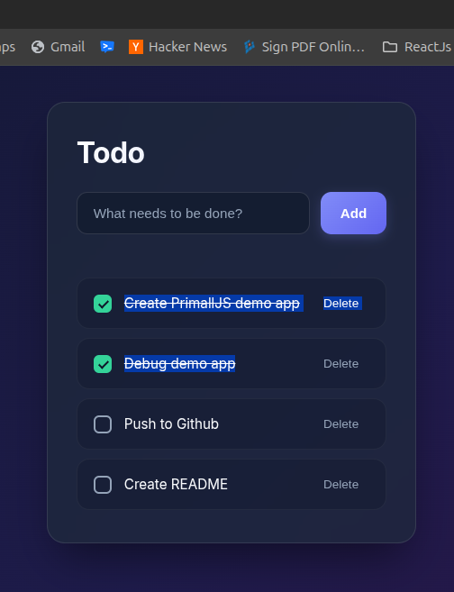

# Todo App (Go + Chi + PrimalJS + SQLite)

A lightweight, modern full-stack Todo application built with a **Go** backend using the **Chi** router and pure-Go **SQLite** driver, coupled with a reactive frontend built using **PrimalJS**.

<p align="center">
  
</p>

---

## Features

- ⚡ **Lightweight Go Backend**: Powered by `go-chi/chi/v5` for clean, fast RESTful API routing.
- 🗄️ **Zero-CGO SQLite Database**: Uses `modernc.org/sqlite` for seamless database persistence without CGO compilation overhead.
- 🎨 **Modern Glassmorphic Frontend**: Reactive UI powered by **PrimalJS** with a sleek dark mode design, smooth micro-animations, and responsive layout.
- 📦 **Zero External JS Build Dependencies**: Runs static browser ES modules (`app.js`, `primal.js`) served straight from Go `http.FileServer`.

---

## Tech Stack

| Layer | Technology |
| :--- | :--- |
| **Language** | Go (1.23+) |
| **HTTP Router** | [Chi v5](https://github.com/go-chi/chi) |
| **Database** | SQLite (`modernc.org/sqlite`) |
| **Frontend Framework** | [PrimalJS](web/vendor/primaljs) (Signals & JSX-like templates) |
| **Styling** | Vanilla CSS3 (Glassmorphism & CSS Custom Properties) |

---

## Project Structure

```text
todo-app/
├── data/              # Database directory (auto-created)
│   └── todo.db        # SQLite database file
├── web/               # Frontend static assets served by Go
│   ├── index.html     # HTML entry point
│   ├── app.js         # PrimalJS application logic & components
│   ├── app.css        # Stylesheet (dark glassmorphism theme)
│   └── vendor/        # Static vendor libraries
│       └── primaljs/  # PrimalJS framework modules
├── go.mod             # Go module definition
├── go.sum             # Go module checksums
├── main.go            # Backend server entry point & API endpoints
├── todo-app.png       # Application UI screenshot
├── .gitignore         # Git ignore rules
└── README.md          # Project documentation
```

---

## Quick Start

### Prerequisites

- **Go**: Version `1.23` or higher installed on your machine.

### Running the Application

1. **Clone the repository**:
   ```bash
   git clone <repository-url>
   cd todo-app
   ```

2. **Install Go dependencies**:
   ```bash
   go mod tidy
   ```

3. **Run the server**:
   ```bash
   go run main.go
   ```

   *Alternatively, build and run the binary:*
   ```bash
   go build -o todo-app main.go
   ./todo-app
   ```

4. **Open in browser**:
   Navigate to [http://localhost:8080](http://localhost:8080) to use the app.

---

## REST API Reference

The backend exposes a JSON REST API under `/api/todos`:

| Method | Endpoint | Description | Request Body Example | Response Example |
| :--- | :--- | :--- | :--- | :--- |
| `GET` | `/api/todos` | List all todo items | — | `[{"id":1,"title":"Buy groceries","completed":false}]` |
| `POST` | `/api/todos` | Create a new todo | `{"title":"Buy groceries"}` | `{"id":1,"title":"Buy groceries","completed":false}` |
| `PATCH` | `/api/todos/{id}` | Toggle completion status | `{"completed":true}` | `{"id":1,"title":"Buy groceries","completed":true}` |
| `DELETE` | `/api/todos/{id}` | Delete a todo by ID | — | `204 No Content` |

---

## Database Schema

SQLite table `todos` automatically created on startup in `data/todo.db`:

```sql
CREATE TABLE IF NOT EXISTS todos (
    id INTEGER PRIMARY KEY AUTOINCREMENT,
    title TEXT NOT NULL,
    completed INTEGER NOT NULL DEFAULT 0
);
```

---

## License

MIT License. Feel free to use and modify for your own projects.
